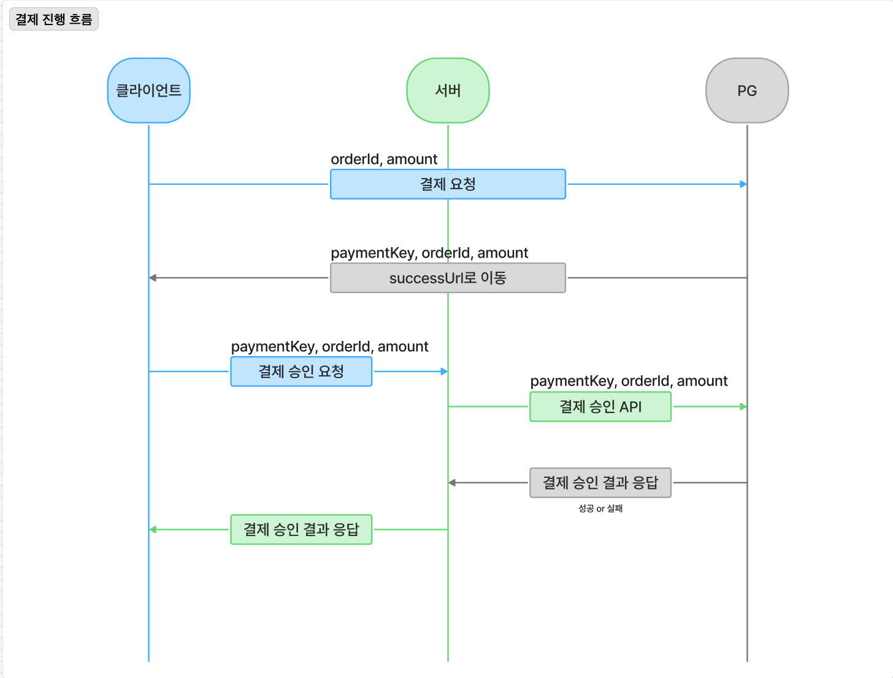

# payment-service

Pagely 플랫폼의 결제 마이크로서비스입니다. 중고 도서 거래의 결제 생성·승인 관리를 담당하며,
Toss Payments PG 연동과 Kafka 기반 이벤트 발행을 처리합니다.

## 1. 프로젝트 설명

Pagely는 독서 모임 커뮤니티와 읽은 도서를 거래할 수 있는 종합 독서 플랫폼입니다.
독서에 대한 관심 증가와 독서 모임 문화 확산에 맞춰, 누구나 쉽게 독서 모임에
참여하고 지속적인 독서 습관을 형성할 수 있도록 기획했습니다.

핵심적으로 다음 세 가지 문제를 해결합니다.

- ✅ 긍정적인 독서 습관 형성 — 독서 모임 및 활동 관리를 통해 자연스러운 독서 참여를
  유도하고 동기를 부여합니다.
- ✅ 독서 진입 장벽 완화 — 읽은 책에 대한 중고 거래로 독서 비용을 절감하고
  선순환 구조를 형성합니다.
- ✅ AI 기반 독서 흥미 유발 — 독후감·활동 데이터를 기반으로 개인화 도서 추천과
  독후 요약을 제공합니다.

## 2. 기술 스택

### 2.1 언어 / 프레임워크

| 기술           | 버전                    | 선택 이유                                       |
|--------------|-----------------------|---------------------------------------------|
| Java         | 21 (Gradle Toolchain) | `record`, 패턴 매칭 등 최신 문법 활용. LTS 버전으로 안정성 확보 |
| Spring Boot  | 3.5.13                | MSA 전 서비스 공통 버전. Jakarta EE 9+ 기반           |
| Spring Cloud | 2025.0.2 (BOM)        | Eureka·OpenFeign 등 MSA 구성요소 버전 정합성 관리       |
| Gradle       | Wrapper (`./gradlew`) | 로컬/CI 빌드 환경 일관성 보장                          |

### 2.2 데이터

| 기술              | 용도                          | 선택 이유                                               |
|-----------------|-----------------------------|-----------------------------------------------------|
| PostgreSQL 16   | 주 데이터베이스 (`pagely_payment`) | 네이티브 `ENUM` 타입으로 결제 상태를 DB 레벨에서 제약                  |
| Spring Data JPA | ORM                         | 결제 도메인의 상태 전이 로직을 엔티티 내부에 응집                        |
| Flyway          | 스키마 마이그레이션                  | 운영 환경 `ddl-auto: validate` 정책과 함께 스키마 변경 이력을 코드로 관리 |

- `flyway-core` + `flyway-database-postgresql` 조합을 사용합니다.

### 2.3 통신 / 인프라

| 기술                     | 용도                   | 선택 이유                                                        |
|------------------------|----------------------|--------------------------------------------------------------|
| Spring Cloud OpenFeign | Toss Payments API 호출 | 인터페이스 선언만으로 HTTP 클라이언트 구성. `ErrorDecoder`로 예외 변환 책임 분리       |
| Spring Kafka           | 서비스 간 비동기 통신         | Market Service와 결제 서비스를 느슨하게 결합. 주문·결제 흐름을 이벤트로 처리           |
| Netflix Eureka Client  | 서비스 디스커버리            | Gateway 및 타 서비스가 동적으로 결제 서비스를 조회                             |
| Spring Cloud Config    | 외부 설정 (optional)     | `optional:configserver`로 선언되어 Config Server 미기동 시에도 로컬 실행 가능 |
| Spring Retry           | PG 일시 장애 재시도         | `spring-kafka`를 통해 클래스패스에 포함. `@Retryable` / `@Recover` 사용   |

### 2.4 공통 / 기타

- **`com.pagely:common:2.0.1`** — 전 서비스 공용 라이브러리 (GitHub Packages 배포).
  `BaseEntity`(감사 컬럼), `BusinessException` / `ErrorCode`, `ApiResponse`,
  인증 어노테이션 `@AuthRequired` / `@CurrentUserId`, `Role` enum 제공.

### 2.5 테스트 / 배포

| 기술                                   | 용도                                                                |
|--------------------------------------|-------------------------------------------------------------------|
| JUnit 5 + `spring-boot-starter-test` | 테스트 프레임워크                                                         |
| H2 (PostgreSQL 모드)                   | 테스트 프로파일 데이터소스 (`ddl-auto: none`, Flyway 비활성)                     |
| Docker (`eclipse-temurin:21`)        | 멀티 스테이지 빌드 — `jdk-alpine`(빌드) → `jre-alpine`(런타임)                 |
| GitHub Actions                       | CI (PR → `dev`/`main` 빌드), CD (`prod` push → Docker Hub → EC2 배포) |

<!-- TODO: 테스트 코드가 현재 PaymentserviceApplicationTests(컨텍스트 로드) 1건뿐입니다.
     동시성/통합 테스트 도입 시 이 표를 갱신해주세요. -->

## 3. 실행 방법

### 3.1 사전 준비

- JDK 21
- Docker / Docker Compose
- GitHub Packages 접근 토큰 (`read:packages` 권한)

공통 라이브러리 `com.pagely:common`은 GitHub Packages에서 받아옵니다.
`~/.gradle/gradle.properties`에 인증 정보를 등록하세요.

```properties
gpr.user=<github-username>
gpr.key=<github-personal-access-token>
```

### 3.2 인프라 기동 (PostgreSQL + Kafka)

인프라 설정은 별도 레포(`infra-repo`)에서 관리합니다.

```bash
cd ../infra-repo

# 환경변수 로드 (DB_USERNAME, DB_PASSWORD, DB_PORT, KAFKA_EXTERNAL_HOST/PORT 등)
set -a && source .env && set +a

# PostgreSQL 기동 (컨테이너 최초 기동 시 pagely_payment DB 자동 생성)
docker compose -f docker-compose.db.yaml up -d

# Kafka 기동 (kafka-ui까지 함께 띄우려면 --profile ui)
docker compose -f docker-compose.kafka.yaml up -d
```

### 3.3 의존 서비스 기동

결제 서비스는 Eureka에 등록되고, Market Service의 주문 이벤트를 소비합니다.
아래 순서로 기동합니다.

```bash
# 1) Eureka Server (http://localhost:8000)
cd ../eureka-server && ./gradlew bootRun

# 2) Config Server (http://localhost:8888) — optional 설정이라 생략 가능
cd ../config-server && ./gradlew bootRun

# 3) Gateway Server — 인증 헤더 전파가 필요한 경우 기동
cd ../gateway-server && ./gradlew bootRun

# 4) Market Service — order-created 이벤트 발행 주체
cd ../market-service && ./gradlew bootRun
```

<!-- TODO: gateway-server / config-server의 실제 포트는 각 서비스 README를 참고해 채워주세요. -->

### 3.4 환경 변수 설정

`src/main/resources/.env` 파일을 생성합니다. (`application.yml`이
`optional:classpath:.env[.properties]`로 로드합니다.)

```dotenv
# Database
DB_HOST=localhost
DB_PORT=5432
PAYMENT_DB_NAME=pagely_payment
DB_USERNAME=<postgres-username>
DB_PASSWORD=<postgres-password>

# Toss Payments
TOSS_API_BASE_URL=https://api.tosspayments.com
TOSS_SECRET_KEY=<toss-test-secret-key>
```

| 변수                            | 설명                                                          |
|-------------------------------|-------------------------------------------------------------|
| `DB_HOST` / `DB_PORT`         | PostgreSQL 접속 정보 (`infra-repo/.env`의 `DB_PORT`와 일치)         |
| `PAYMENT_DB_NAME`             | 결제 서비스 전용 DB. `infra-repo` 초기화 스크립트가 `pagely_payment`로 생성   |
| `DB_USERNAME` / `DB_PASSWORD` | PostgreSQL 계정                                               |
| `TOSS_API_BASE_URL`           | Toss 결제 API Base URL. 로컬 부하 테스트 시 목 서버 주소로 대체 가능            |
| `TOSS_SECRET_KEY`             | Toss 시크릿 키. Feign 인터셉터가 `Basic <base64(secretKey:)>` 헤더로 변환 |

> Kafka 브로커 주소는 `application.yml`에 `localhost:9092`로 고정되어 있습니다.
> `infra-repo/.env`의 `KAFKA_EXTERNAL_PORT`가 `9092`가 아니라면 해당 값을 맞춰주세요.

### 3.5 애플리케이션 실행

```bash
cd payment-service

# 실행 (Flyway 마이그레이션이 기동 시 자동 수행됩니다)
./gradlew bootRun
```

기동 후 `http://localhost:19041`에서 동작하며, Eureka에 `PAYMENTSERVICE`로 등록됩니다.

### 3.6 빌드 / 테스트

```bash
# 전체 빌드 (테스트 포함)
./gradlew build

# 테스트만 실행
./gradlew test

# 단일 테스트 클래스
./gradlew test --tests "com.pagely.paymentservice.PaymentserviceApplicationTests"

# 실행 가능한 JAR 생성 (테스트 생략)
./gradlew bootJar
```

### 3.7 Docker 실행

```bash
# 이미지 빌드 (GitHub Packages 인증 정보를 build-arg로 전달)
docker build \
  --build-arg GPR_USER=<github-username> \
  --build-arg GPR_KEY=<github-personal-access-token> \
  -t pagely/payment-service:latest .

# 컨테이너 실행
docker run -d \
  --name payment \
  -p 19041:19041 \
  -e SPRING_PROFILES_ACTIVE=prod \
  --env-file .env \
  --restart always \
  pagely/payment-service:latest
```

`prod` 프로파일에서는 Config Server(`config-server:8888`), Eureka(`EUREKA_SERVER_URL`),
Kafka(`KAFKA_EXTERNAL_HOST` / `KAFKA_EXTERNAL_PORT`) 주소를 환경변수로 주입받습니다.

## 4. 주요 구현

### 4.1 패키지 구조 (계층형 아키텍처)

```
presentation/     REST 컨트롤러, 요청/응답 DTO
application/      유스케이스 서비스, 커맨드/결과 객체, 아웃바운드 포트, PG 예외
domain/           JPA 엔티티, 도메인 이벤트, 리포지토리 인터페이스, 에러코드
infrastructure/   어댑터 — JPA, Feign(Toss), Kafka, Spring 이벤트 퍼블리셔
```

- 도메인/애플리케이션 계층은 `PaymentProvider`, `PaymentEventPort`, `PaymentRepository`,
  `PaymentEvents` 등 **인터페이스(포트)** 에만 의존하고, 구현체는 `infrastructure`에 위치합니다.
- 덕분에 Toss → 타 PG사 교체, Kafka → 다른 메시지 브로커 교체 시 도메인 코드 변경이 없습니다.

### 4.2 결제 생성 — 주문 이벤트 소비

Market Service가 발행한 `order-created` 토픽을 구독해 결제 정보를 생성합니다.

```
[market-service] ── order-created ──▶ KafkaOrderCreatedConsumer
                                          └─▶ PaymentCommandService.createPayment()
                                                └─▶ Payment(status = READY) 저장
```

- 컨슈머 그룹: `payment-service`, `auto-offset-reset: earliest`
- 메시지를 `String`으로 수신한 뒤 `ObjectMapper`로 `OrderCreatedEvent`에 역직렬화합니다.
- `p_payment.order_id`에 UNIQUE 제약이 있어
  동일 주문에 대한 결제 중복 생성을 DB 레벨에서 차단합니다.

<!-- TODO: 역직렬화/처리 실패 시 재처리 로직이 TODO 주석으로 남아 있습니다 (DLQ 등 미구현). -->

### 4.3 결제 승인 흐름

`PaymentCommandFacade`가 전체 승인 흐름을 조율합니다.
**외부 API 호출(Toss)을 트랜잭션 밖으로 분리**해, PG 응답 지연이 DB 커넥션을 점유하지 않도록 했습니다.

```
PaymentController
  └─ PaymentCommandFacade.confirmPayment()
       │
       ├─ ① PaymentQueryService.findIfAlreadyCompleted()   ← 멱등성 체크
       │      COMPLETED면 DB 조회 결과를 그대로 반환하고 종료
       │
       ├─ ② PaymentCommandService.validateAndMarkConfirmRequested()   [트랜잭션]
       │      구매자 검증 · 금액 검증 · 상태 READY → CONFIRM_REQUESTED
       │
       ├─ ③ PaymentProvider.confirm()   [트랜잭션 밖 — Toss API 호출]
       │
       └─ ④ PaymentCommandService.applyConfirmedResult()   [트랜잭션]
              PG 응답 검증(orderId·금액) · 상태 COMPLETED
              · PaymentHistory 추가 · PaymentHold 생성
              · PaymentCompletedEvent 발행
```

**✅ 멱등성 보장** — 승인 진입 시점에 이미 `COMPLETED`인 결제는 PG를 호출하지 않고
저장된 결과를 그대로 반환합니다. 네트워크 재시도나 사용자의 중복 클릭으로 인한
이중 승인 요청을 방어합니다.

**🔄 상태 생명주기**

```
READY ──▶ CONFIRM_REQUESTED ──▶ COMPLETED
  │              │
  └──────────────┴──▶ FAILED
```

| 상태                  | 의미                                            |
|---------------------|-----------------------------------------------|
| `READY`             | 결제 준비 (PG 요청 전 초기 상태)                         |
| `CONFIRM_REQUESTED` | 승인 요청 후 PG 응답 대기                              |
| `COMPLETED`         | 승인 완료                                         |
| `FAILED`            | PG 거절 또는 시스템 오류로 실패                           |
| `CANCELLED`         | 환불 완료 <!-- TODO: enum에 정의되어 있으나 전이 로직 미구현 --> |

상태 전이 규칙은 모두 `Payment` 엔티티 내부 메서드(`markConfirmRequested`, `confirm`, `markFailed`)에
캡슐화되어 있어, 서비스 계층에서 상태를 직접 대입할 수 없습니다.

### 4.4 Toss PG 연동

**Feign Client**

```java

@FeignClient(name = "toss", url = "${toss.base-url}", configuration = TossPaymentFeignConfig.class)
public interface TossPaymentClient {
    @PostMapping("/v1/payments/confirm")
    TossConfirmResponse confirm(@RequestBody TossConfirmRequest request);
}
```

**인증 처리** — `TossPaymentFeignConfig`의 `RequestInterceptor`가 시크릿 키를
`Base64(secretKey + ":")`로 인코딩해 `Authorization: Basic ...` 헤더에 자동 주입합니다.
호출부는 인증을 신경 쓰지 않습니다.

**재시도 정책** — `TossPaymentProviderAdaptor`

```java

@Retryable(
        retryFor = PgSystemException.class,     // 5XX(일시 장애)만 재시도
        maxAttempts = 3,
        backoff = @Backoff(delay = 1000L, multiplier = 2, maxDelay = 5000L)  // 1s → 2s → 4s
)
public PaymentProviderConfirmResult confirm(String paymentKey, String orderId, int amount) { ...}

@Recover
public PaymentProviderConfirmResult recoverFromSystemError(PgSystemException e, ...) { ...}
```

- `PgRejectedException`(4XX)은 재시도해도 결과가 같으므로 대상에서 제외했습니다.
- 3회 소진 시 `@Recover`가 호출되어 로깅 후 예외를 전파하고, Facade가 `FAILED` 처리합니다.

**응답 변환** — `TossConfirmResponse.toResult()`가 Toss의 `OffsetDateTime` 승인 시각을
`Asia/Seoul` 기준 `LocalDateTime`으로 변환합니다. `@JsonIgnoreProperties(ignoreUnknown = true)`로
Toss 응답 스펙 확장에 대응합니다.

### 4.5 이벤트 발행 (2단계 구조)

결제 결과를 Market Service에 알리는 이벤트는 **도메인 이벤트 → Kafka** 2단계로 발행됩니다.

```
PaymentCommandService
  └─ PaymentEvents (도메인 인터페이스)
       └─ SpringPaymentEventPublisher  ─ ApplicationEventPublisher ─▶
            PaymentEventHandlerAdapter  @TransactionalEventListener(AFTER_COMMIT)
                 └─ KafkaPaymentEventAdapter ─▶ Kafka
```

| 토픽                       | 발행 시점    | 페이로드                                                                  |
|--------------------------|----------|-----------------------------------------------------------------------|
| `payment-completed`      | 결제 승인 성공 | `orderId`, `paymentId`, `buyerId`, `sellerId`, `amount`, `approvedAt` |
| `payment-confirm-failed` | 결제 승인 실패 | `orderId`, `paymentId`, `amount`                                      |

- **`AFTER_COMMIT`** 단계에 발행하여, 트랜잭션이 롤백되면 이벤트도 발행되지 않습니다.
  DB에는 실패로 남았는데 "결제 완료" 메시지가 나가는 상황을 방지합니다.
- 모든 이벤트는 `BaseEvent`를 상속해 `eventId`, `eventType`, `domainType`, `domainId`,
  `occurredAt` 메타데이터를 공통으로 갖습니다. 메시지 키는 `domainId`를 사용합니다.
- Kafka 발행은 비동기(`whenComplete`)로 처리하고 성공/실패를 로깅합니다.

### 4.6 도메인 모델

| 엔티티              | 테이블                 | 역할                                                   |
|------------------|---------------------|------------------------------------------------------|
| `Payment`        | `p_payment`         | 결제 애그리거트 루트. 상태 전이 규칙 보유                             |
| `PaymentHistory` | `p_payment_history` | 상태 변경 이력 (이전 상태 / 변경 상태 / 사유)                        |
| `PaymentHold`    | `p_payment_hold`    | 승인 완료 시 생성되는 보류금. 판매자 정산 전까지 보관                      |
| `Settlement`     | `p_settlement`      | 정산 (판매 금액 / 수수료 / 실지급액) <!-- TODO: 정산 서비스 로직 미구현 --> |

- 승인 성공 시 `Payment.confirm()` 내부에서 `PaymentHistory`와 `PaymentHold`가 함께 생성되고,
  `CascadeType.ALL`로 한 트랜잭션에 저장됩니다.
- 모든 엔티티는 공통 라이브러리의 `BaseEntity`를 상속해
  `created_at/by`, `updated_at/by`, `deleted_at/by` 감사 컬럼을 갖습니다.

### 4.7 에러 코드

| 코드                          | HTTP | 설명            |
|-----------------------------|------|---------------|
| `PAYMENT_BUYER_MISMATCH`    | 403  | 결제자 정보 불일치    |
| `PAYMENT_AMOUNT_MISMATCH`   | 400  | 결제 금액 불일치     |
| `PAYMENT_ORDER_ID_MISMATCH` | 400  | 주문 ID 불일치     |
| `PAYMENT_NOT_CONFIRMABLE`   | 400  | 현재 상태에서 승인 불가 |
| `PAYMENT_ALREADY_COMPLETED` | 409  | 이미 승인 완료      |
| `PAYMENT_ALREADY_CANCELLED` | 409  | 이미 승인 취소      |
| `PAYMENT_NOT_FOUND`         | 404  | 결제 정보 없음      |
| `PG_CONFIRM_FAILED`         | 502  | PG 승인 실패      |
| `PG_REJECTED`               | 400  | 카드사/PG 결제 거절  |
| `PG_SYSTEM_ERROR`           | 503  | PG 시스템 오류     |

## 5. 트러블슈팅

### 5.1 PG 결제 승인 실패 처리 흐름 — Feign ErrorDecoder

- 문제: 외부 PG(Toss) API 호출 시 발생하는 예외를 그대로 노출하면 비즈니스 의미가
  사라지고 호출부 코드가 복잡해짐.
- 해결: Feign ErrorDecoder 기반 예외 처리 구조를 구성해 파싱과 예외 변환 책임을
  한 곳에 응집. FeignException 의존 없이 외부 API 예외를 비즈니스 의미를 가진
  커스텀 예외로 추상화하여 전달.
- 처리 정책 (PG 에러 코드 / HTTP 상태코드로 예외 유형 분리):
    - 이미 처리된 결제 → PG 조회 후 데이터 정합성 보장
    - 4XX 에러 → 재시도 없이 즉시 실패 처리
    - 5XX 에러 → 일시적 장애로 판단하여 재처리 수행
- 결제 승인 API는 성공/실패 흐름을 분리해, 예외는 별도 처리하고 성공 이벤트와
  실패 이벤트를 각각 발행함.

## 6. 데모 / 이미지

### 6.1 결제 승인 플로우

<!-- TODO: 결제 승인 전체 플로우 GIF 또는 시연 영상 링크를 채워주세요 -->

